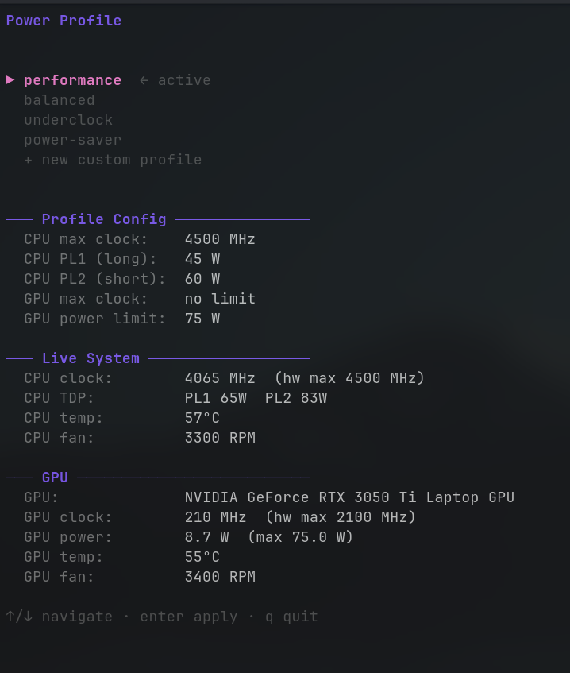
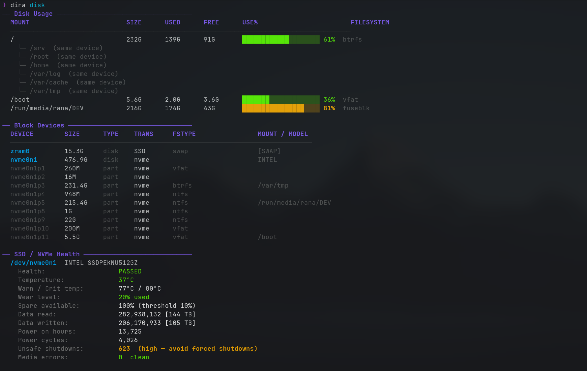
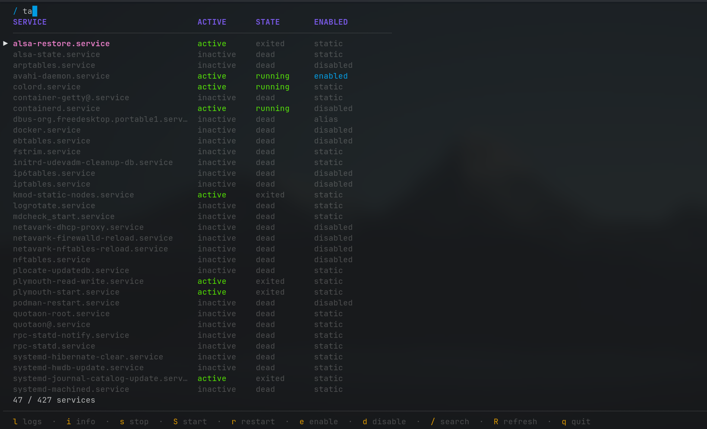
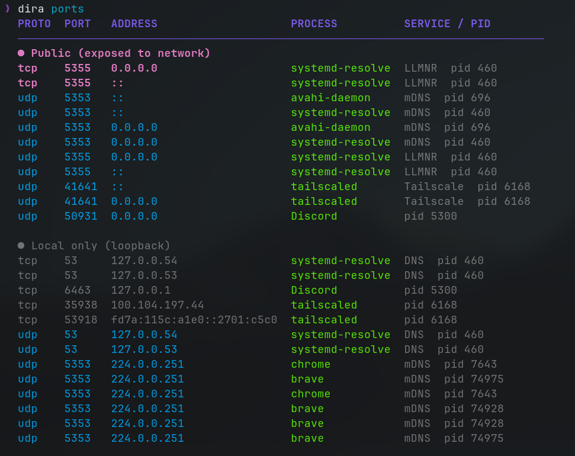
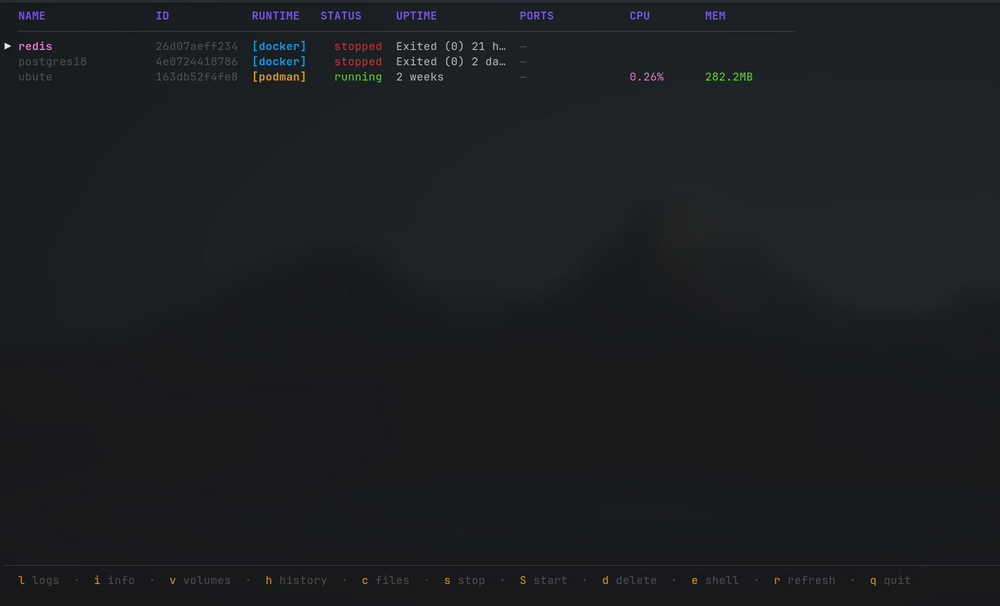
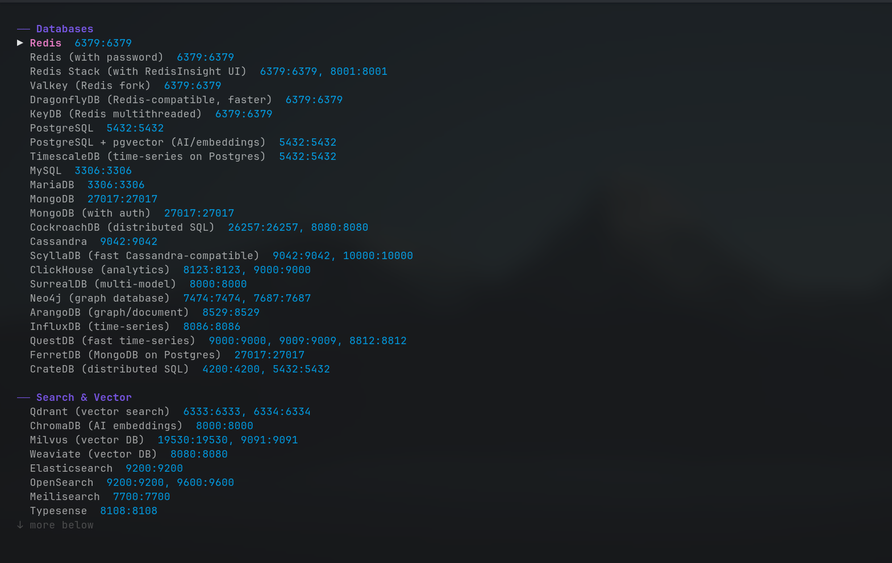

# dira

A Linux system helper tool for ASUS TUF laptops (and compatible hardware).

## Install

```bash
git clone <repo>
cd dira
go install
```

> Requires `python3`, `sudo`, `smartctl`, `nvidia-smi`, `cpupower` for full functionality.

## Commands

### `power`

Interactive power profile manager with live system stats.

```bash
dira power
# profiles: performance | balanced | underclock | power-saver | custom
```

Shows CPU/GPU clocks, TDP, temps, and fan speeds alongside each profile's config.
Custom profiles are saved to SQLite and persist across sessions.



### `info`

Show detailed hardware information.

```bash
dira info                 # all sections
dira info --cpu           # CPU only
dira info --gpu           # GPU only
dira info --ram           # RAM only
dira info --ssd           # SSD only
dira info --battery       # battery only
dira info --wifi          # WiFi only
dira info --bios          # system/BIOS only
```

Covers: CPU clocks/temps/TDP, dual GPU support, VRAM, NVMe health/wear/PCIe speed, battery health %, WiFi card + temp, BIOS version.

### `disk`

Show disk usage, partition layout, and SSD/NVMe health.

```bash
dira disk
```


Displays:

- Mount points with usage bars and filesystem type
- Block device tree (disks, partitions, HDD/SSD/NVMe type)
- Per-drive SMART health, wear level, temperature, power-on hours, unsafe shutdowns, and media errors

### `service`

Manage systemd services interactively.

```bash
dira service
```



Browse all installed services with live status. Keybinds:

| Key | Action                |
| --- | --------------------- |
| `l` | View logs (colorized) |
| `i` | Show service info     |
| `S` | Start                 |
| `s` | Stop                  |
| `r` | Restart               |
| `e` | Enable                |
| `d` | Disable               |
| `/` | Search / filter       |
| `R` | Refresh list          |
| `q` | Quit                  |

### `ports`

Show listening ports and the processes behind them.

```bash
dira ports           # TCP + UDP listeners
dira ports -p        # public (exposed) only
dira ports -l        # local (loopback) only
dira ports --tcp     # TCP only
dira ports --udp     # UDP only
dira ports -a        # all sockets (not just listening)
```



Public ports are highlighted separately from local-only ports. Known services are labelled automatically (SSH, HTTP, Redis, PostgreSQL, etc.) and suspicious ports are flagged with a warning.

### `container`

Manage Docker and Podman containers interactively.

```bash
dira container
```



Lists all containers from both runtimes with live CPU/memory stats. Keybinds:

| Key | Action                           |
| --- | -------------------------------- |
| `l` | View logs (colorized)            |
| `i` | Inspect (resources, env, mounts) |
| `v` | Show volumes / mounts            |
| `h` | Image layer history              |
| `c` | Edit a file inside the container |
| `e` | Open a shell (`/bin/sh`)         |
| `S` | Start                            |
| `s` | Stop                             |
| `d` | Delete                           |
| `r` | Refresh list                     |
| `q` | Quit                             |

### `run`

Quick-launch a container from a preset or any image — no flags to memorize.

```bash
dira run              # interactive: pick a preset or search the registry
dira run redis        # instant: launch Redis with sensible defaults
dira run postgres     # instant: launch PostgreSQL (password: dira123)
dira run mongo        # instant: launch MongoDB
```



Supports both Docker and Podman. Detects the available runtime automatically.
The interactive flow lets you filter presets, edit ports/env/image before launch, and search the registry for custom images.

Built-in preset categories:

- **Databases** — Redis, Valkey, DragonflyDB, PostgreSQL (+pgvector, TimescaleDB), MySQL, MariaDB, MongoDB, CockroachDB, Cassandra, ScyllaDB, ClickHouse, SurrealDB, Neo4j, ArangoDB, InfluxDB, QuestDB, and more
- **Search & Vector** — Qdrant, ChromaDB, Milvus, Weaviate, Elasticsearch, OpenSearch, Meilisearch, Typesense
- **Cache** — Memcached
- **Queues** — RabbitMQ, Kafka (KRaft), NATS (+JetStream), Apache Pulsar
- **Web & Proxy** — Nginx, Caddy, Traefik, httpbin
- **Storage** — MinIO, Docker Registry
- **Dev Tools** — Adminer, pgAdmin, phpMyAdmin, Mongo Express, RedisInsight, Kafka UI, Mailpit, Wiremock, SonarQube, Gitea
- **Infrastructure** — Vault, Consul, etcd, Jaeger, Prometheus, Grafana, Keycloak, LocalStack

## TUI Navigation

```
↑ / k   move up
↓ / j   move down
enter   select
q       cancel
```

## License

MIT
